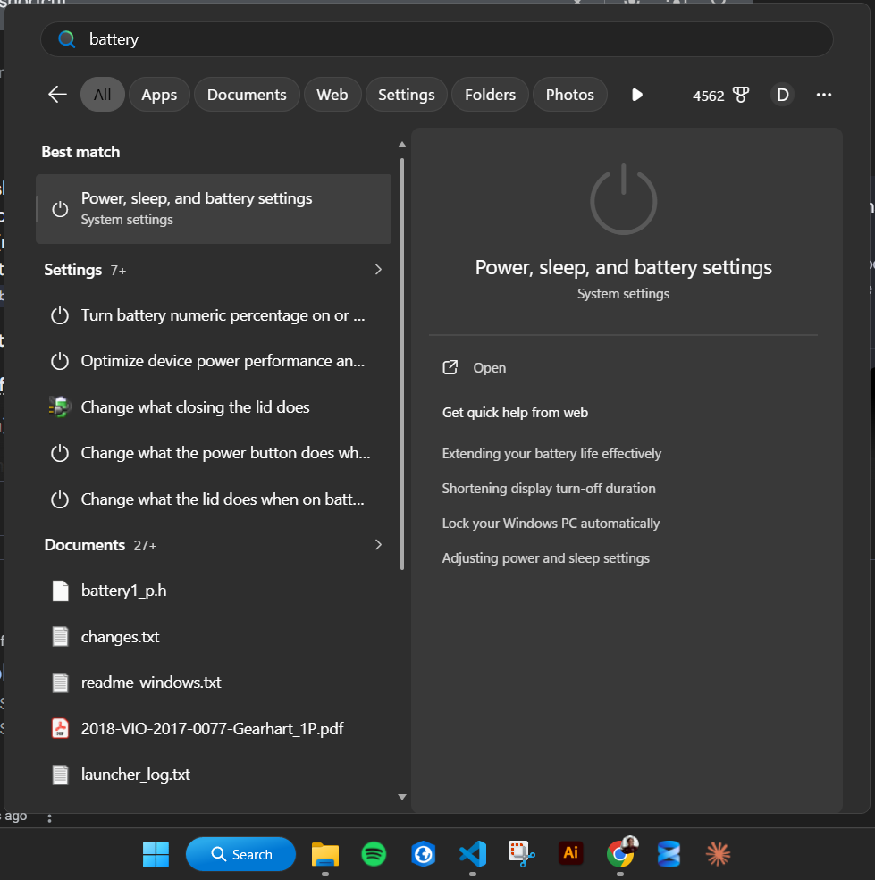
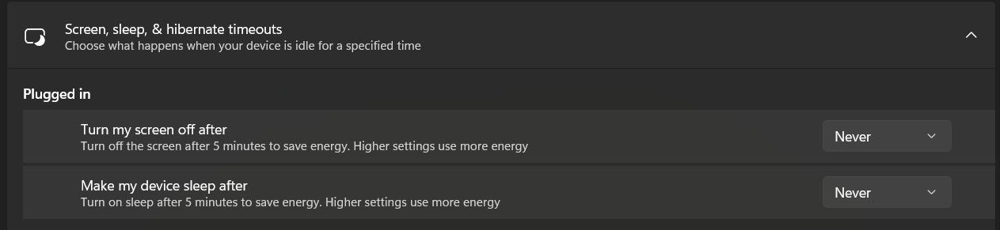
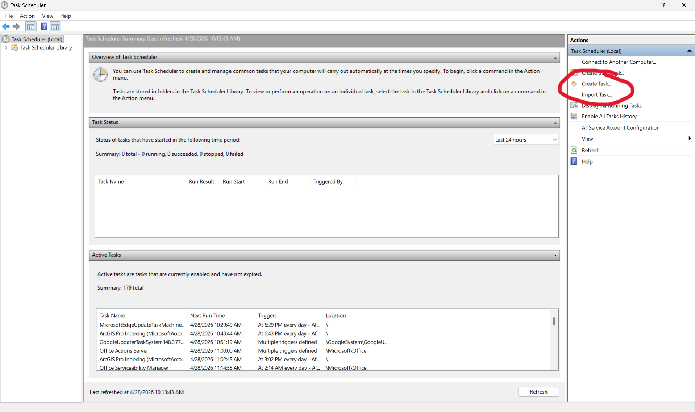
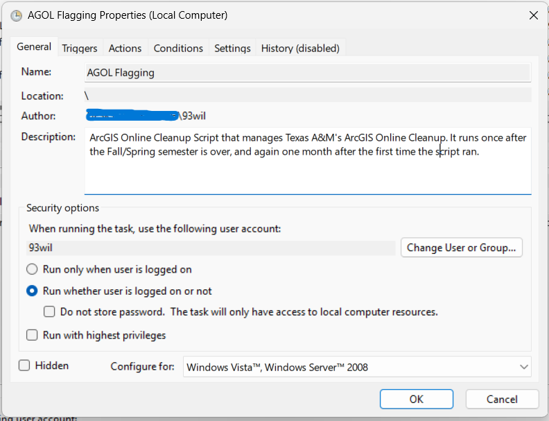
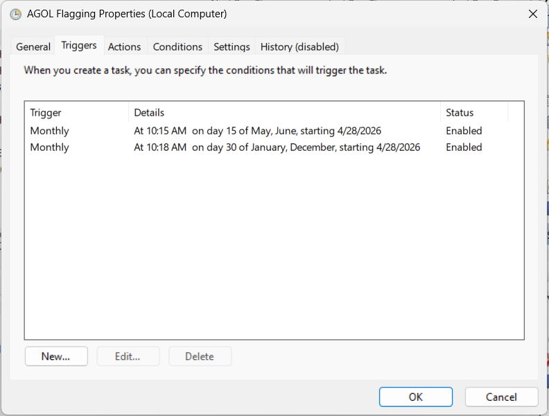
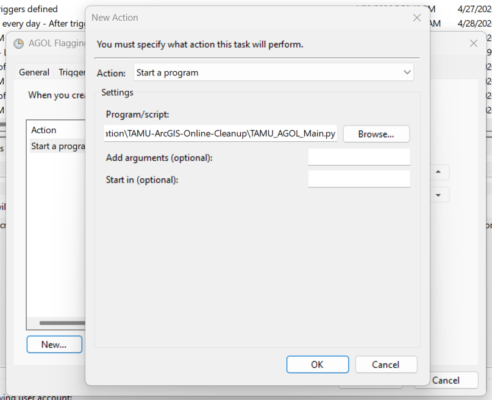
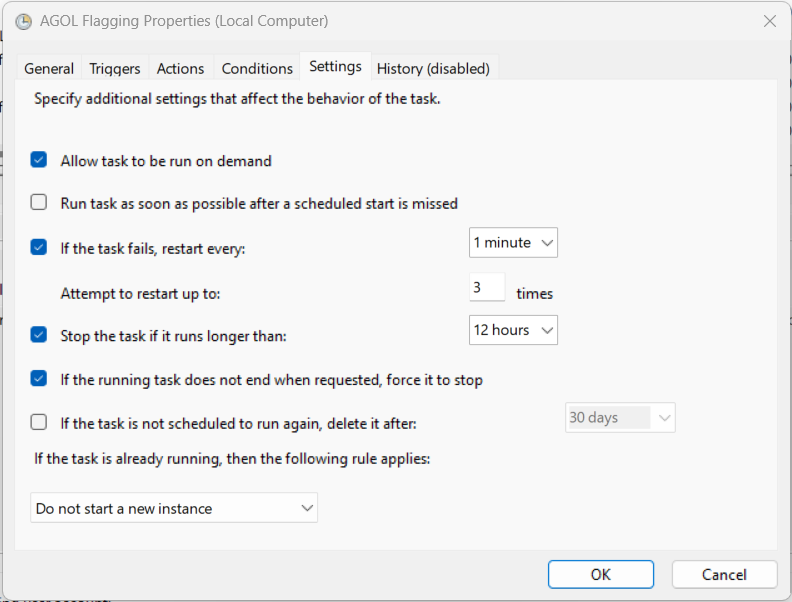
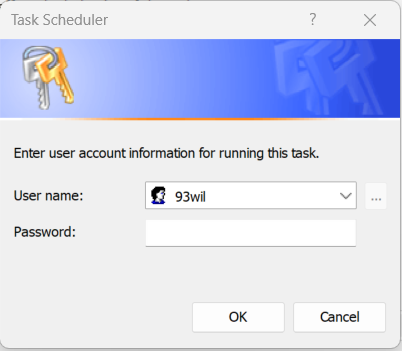
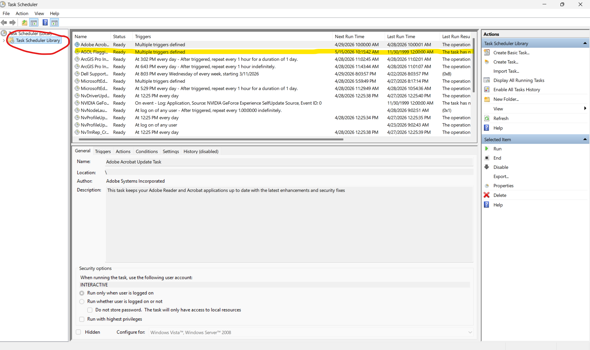

# Confguring scripts on Task Scheduler

Author: Dalton Peterson

Last Updated: April 2026

## Background

Task Scheduler is a program on Windows that allows a user to schedule programs and scripts to be run automatically with specified triggers (i.e. every month, or when a certain action happens on a computer). It is used to automatically run the scripts in this repo.

## Notes

- **The Computer that runs these scripts needs to be turned on and connected to a charger at the specified trigger times.** If it is not, then the scripts will not run.

## I. Verifying power & sleep mode timeouts

- Because the scripts take a fairly long time to run (~3 hours), we need to make sure that the computer that they run on won't turn off during the runtime.

1. Navigate to Power, sleep and battery settings

    

2. Locate "Screen, sleep and hibernation timeouts" and ensure that both dropdowns under "Plugged in" are set to "Never"

    

## II. Configuring Task Scheduler

3. Search for "Task Scheduler" in the Windows start menu and open Task Scheduler

4. On the right side of the main page, select "New Task". The task configurer window will appear

    

5. Under the General tab, give the task a name (I used simply "AGOL Flagging") and a description (I used "ArcGIS Online Cleanup Script tht manages Texas A&M's ArcGIS Online Cleanup. It runs once after the Fall/Spring semester is over, and again one month after the first time the script ran."). Then check "Run whether user is logged on or not"

    

6. Under the Triggers tab, add the following triggers:

    1. Monthly on May and June 15. This will cover the end of the Spring semester (which generally ends within the first 2 weeks of May)

    2. Monthly on December and January 30. This will cover the end of the Fall semester (which generally ends on the second or third week of December)

    

7. Under the Actions tab, in the "Action:" dropdown, make sure that "Start a Program" is slected. Select "Browse" under Program/script and navigate to the TAMU_AGOL_Main.py script in this repo. Then press "OK".

    

8. Leave the "Conditions" tab unchanged.

9. Under the "Settings" tab, configure the settings to match the following image  ensure that the script attempts to be rerun 3 times upon failure:

    

10. Once all the properties have been configured, press "OK" at the bottom of the window. You will be prompted to enter the password for the account you're logged in on

    

11. If you click "Task Scheduler Library" on the leftmost pane, you should be able to see your new task configured in the list of tasks.

    